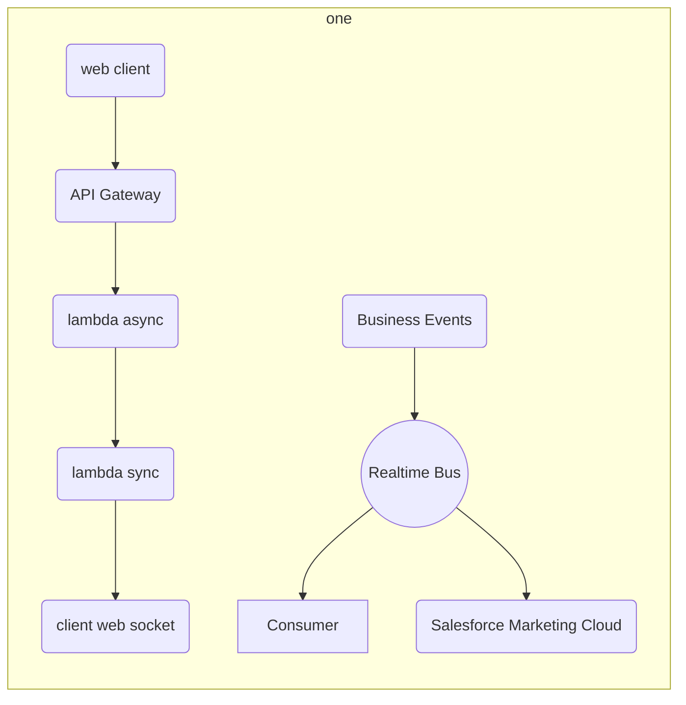
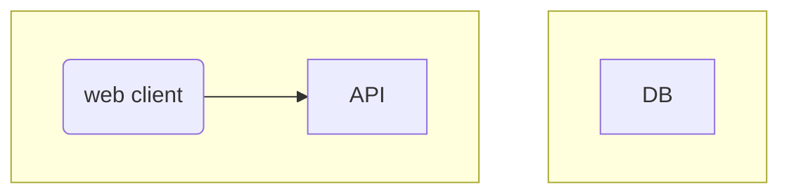
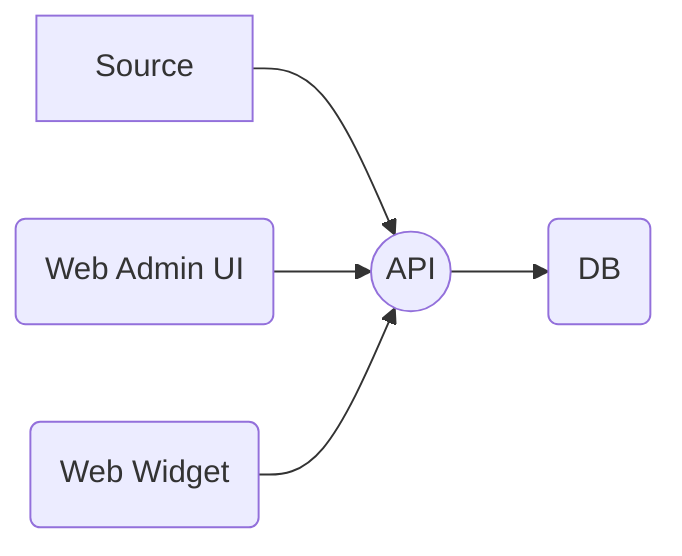

+++
author = "Brian Pfeil"
categories = ["<nil>", "playground"]
date = 2020-12-10
description = ""
summary = " "
draft = true
slug = "mermaid-diagram"
tags = ["diagrams","visualize","architecture",]
title = "Mermaid Diagram"
repoFullName = "pfeilbr/mermaid-diagram-playground"
repoHTMLURL = "https://github.com/pfeilbr/mermaid-diagram-playground"
truncated = true

+++

<div class="alert alert-info small bg-info" role="alert">
<span class="text-muted">code for article</span>&nbsp;<a href="https://github.com/pfeilbr/mermaid-diagram-playground" target="_blank"><i class="fab fa-github fa-sm"></i>&nbsp;pfeilbr/mermaid-diagram-playground</a>
</div>


learn [Mermaid](https://mermaid-js.github.io/), which lets you represent diagrams using text and code

## Examples

Can view the following inline in vscode via [vscode | Markdown Preview Mermaid Support](https://marketplace.visualstudio.com/items?itemName=bierner.markdown-mermaid) with "Markdown: Open Preview to Side" command.

Or copy contents to mermaid file and use [mermaid cli](https://github.com/mermaid-js/mermaid-cli) to generate file (svg, png or pdf).

```sh
# install deps
npm install

# uses mmdc installed as local package
npm run mmdc -- -i sample.mmd -o sample.pdf
npm run mmdc -- -i sample.mmd -o sample.png
npm run mmdc -- -i sample.mmd -o svg.png
npm run mmdc -- --help
```










## Resources

* [Mermaid](https://mermaid-js.github.io/)
* [mermaid-js/mermaid](https://github.com/mermaid-js/mermaid)
* [mermaid-js/mermaid-cli](https://github.com/mermaid-js/mermaid-cli) - mermaid cli
* [vscode | Markdown Preview Mermaid Support](https://marketplace.visualstudio.com/items?itemName=bierner.markdown-mermaid)


