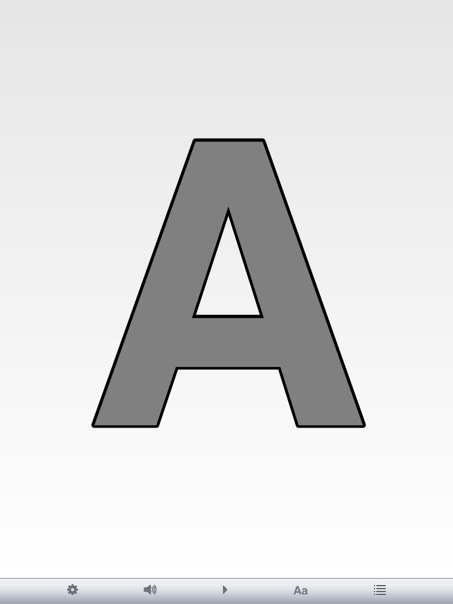
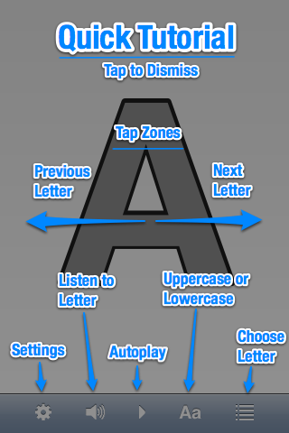

+++
title = "Alpha Sound"
description = "Um programa simples para crianças aprenderem o alfabeto."
date = 2014-08-04T18:55:46Z
draft = false
weight = 4
+++

Alpha Sound é um programa simples para crianças aprenderem o alfabeto. As crianças aprendem as letras vendo e ouvindo o nome de cada uma. É um app gratuito, [disponível na App Store](http://itunes.apple.com/us/app/alpha-sound/id493812596?mt=8)

</img>
</img>

[Página do Alpha Sound](/ios-apps/alpha-sound)

