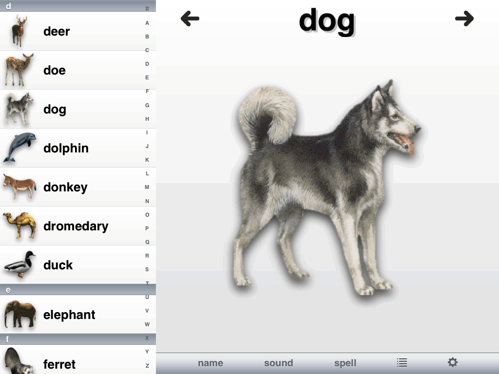
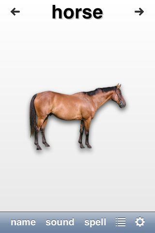

+++
title = "Animal Fun"
description = "아이들이 동물을 배울 수 있게 도와주는 iPhone·iPad 앱."
date = 2014-08-04T18:55:46Z
draft = false
weight = 2
+++

Animal Fun은 세 살이던 아들이 즐겁게 놀면서 동물을 배울 수 있도록 제가 만든 iPhone·iPad 앱입니다. 무료 앱이며 [App Store에서 받을 수 있고](http://itunes.apple.com/us/app/animal-fun/id314278061?mt=8) [소스 코드는 github에 공개되어 있습니다](https://github.com/pfeilbr/animalfun)

</img>
</img>

