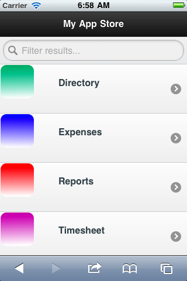
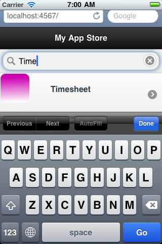
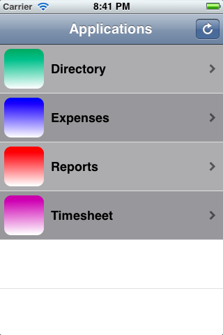
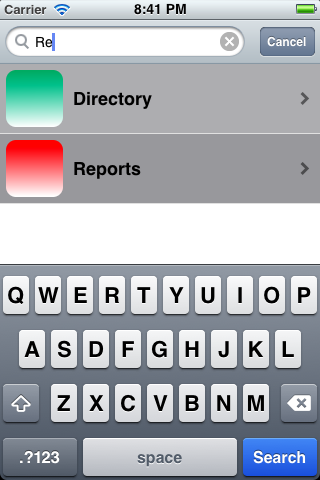
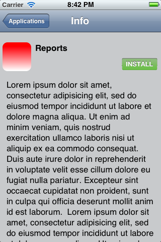

+++
title = "iOS Enterprise App Store"
description = "Solução de distribuição interna de apps para membros do iOS Developer Enterprise Program."
date = 2014-08-04T18:55:46Z
draft = false
weight = 7
+++

Empresas que participam do [iOS Developer Enterpise Program](http://developer.apple.com/programs/ios/enterprise/) podem distribuir os apps dos seus funcionários por meio da própria App Store, usando a [distribuição over-the-air](http://developer.apple.com/library/ios/#featuredarticles/FA_Wireless_Enterprise_App_Distribution/Introduction/Introduction.html) da Apple. Com esta solução, basta jogar o arquivo .ipa do app e um arquivo com as informações dele num diretório, e ele fica disponível na hora para os usuários instalarem.

O backend é uma aplicação web em [Sinatra](http://www.sinatrarb.com/). No front-end há uma interface web em [jQuery Mobile](http://jquerymobile.com/) já embutida, além de um app nativo de iPhone à parte.

**App Store como aplicação web**

</img>
</img>

**Cliente nativo da App Store para iPhone**

</img>
</img>
</img>

*[código-fonte](https://github.com/pfeilbr/ios-enterprise-app-store)*
