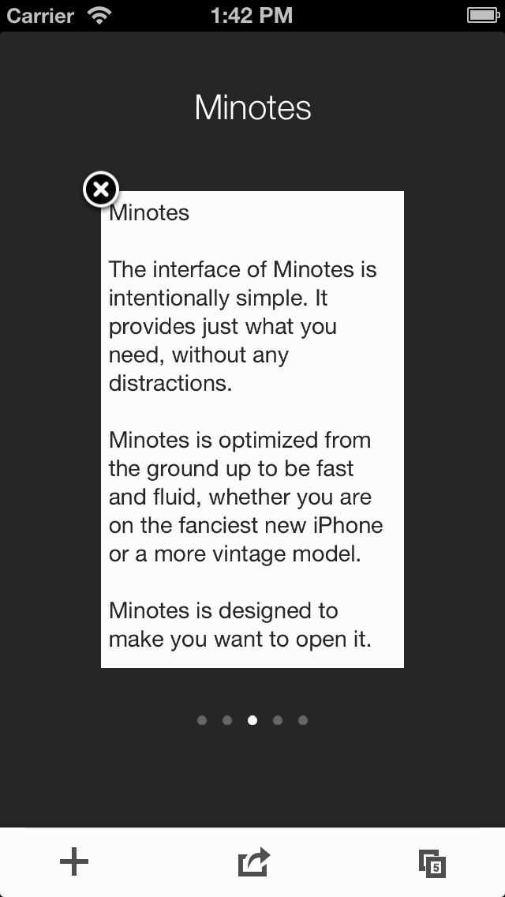
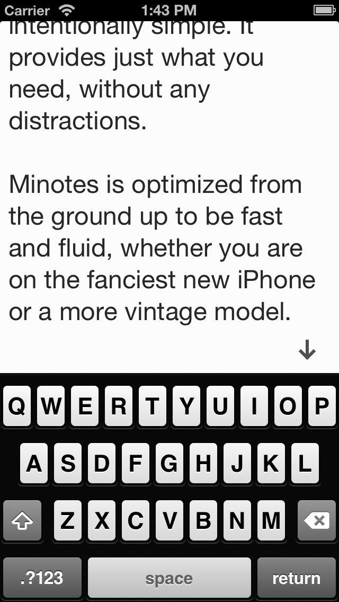
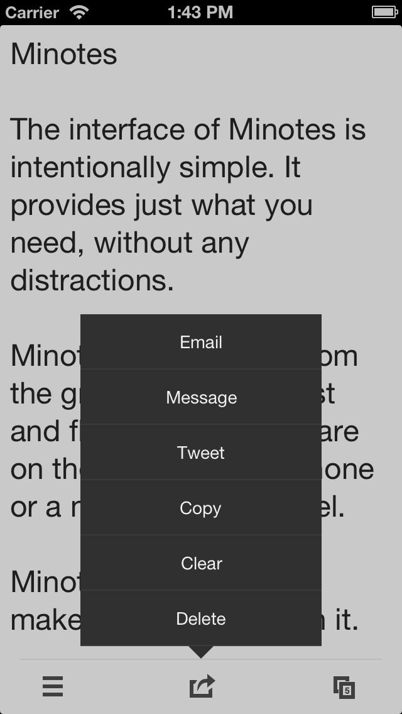

+++
title = "Minotes"
description = "Minimalistische Notizen-App — schnelles, klares und schönes Notieren unter iOS."
date = 2014-08-04T18:55:46Z
draft = false
weight = 1
+++

Minotes — minimalist notes — ist von Grund auf dafür gebaut, Notizen schnell und klar festzuhalten. Statt Funktionen in eine überladene Oberfläche zu stopfen, gibt Minotes deinen Notizen eine minimale, aufgeräumte Oberfläche.

* **klar** — Die Oberfläche von Minotes ist bewusst schlicht. Sie bietet genau das, was man braucht, ohne Ablenkung
* **schnell** — Minotes ist von Grund auf auf Tempo und flüssige Bedienung ausgelegt, egal ob auf dem neuesten iPhone oder einem älteren Modell.
* **schön** — Von der durchdachten Navigation bis zur bewusst knappen Auswahl an Einstellungen: Minotes ist so gestaltet, dass man es öffnen will.

<a href="http://minote.net" target="_blank">Minotes Produktseite</a>

