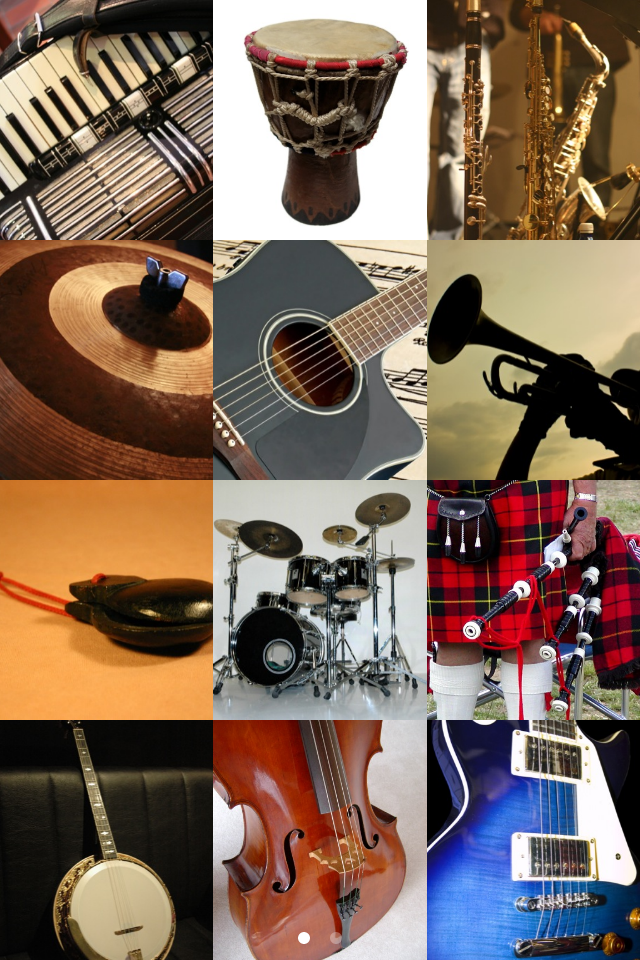
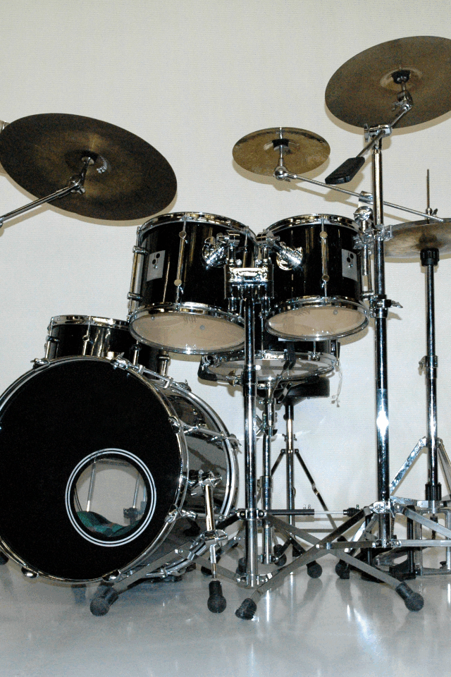

+++
title = "Music Sound Touch"
description = "为幼儿设计的互动音乐应用，配有真实乐器的图片和声音。"
date = 2014-08-04T18:55:46Z
draft = false
weight = 5
+++

一款由父母设计、有趣又好上手的互动音乐应用，适合喜欢乐器模样和声音的幼儿。里面收集了大量真实乐器的图片和声音，轻轻一点就能播放。除了声音，还会念出乐器的名字。足够让小朋友玩上好一阵子！

[Music Sound Touch 产品页](/ios-apps/music-sound-touch)

